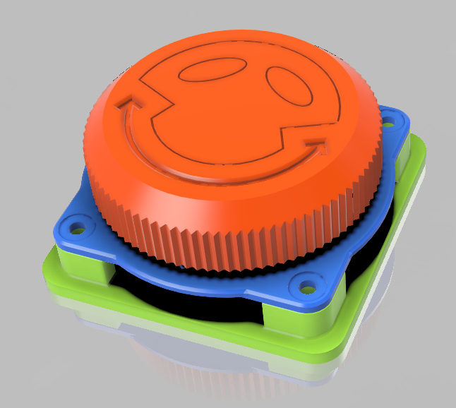
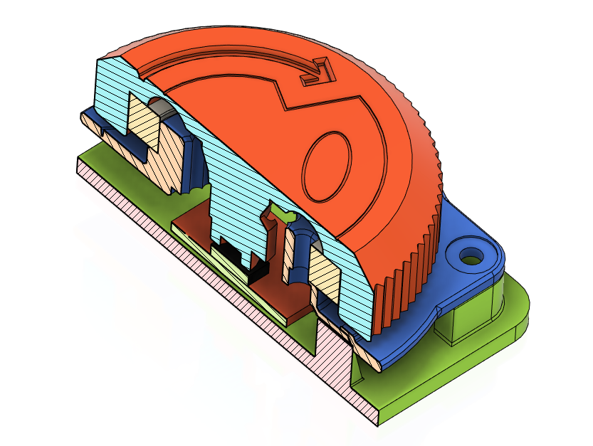

CNC pendant project to control my Genmitsu 4040 milling machine.

Main CHIP: ESP8266EX
AS5600 encoder based knob
3.2 inch capacitive touch display (https://www.buydisplay.com/3-2-inch-capacitive-touchscreen-240x320-tft-lcd-module-display)
I2C EEPROM for settings storage

TCP Testing software:
Hercules
TcpTerminal
